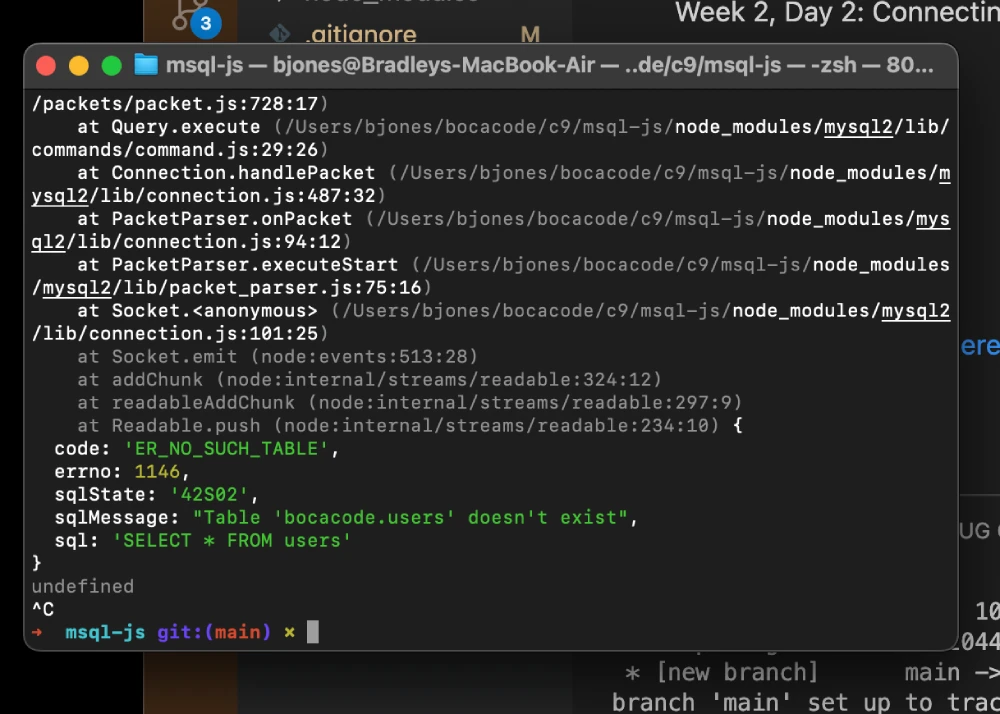

# MySQL with JavaScript
Week 2, Day 2: Connecting MYSQL with JavaScript using Node.

## Lesson Learned
1. Node
2. NPM
3. MySQL
4. Secrets

To see the repo [click here](https://github.com/BJ2044/mysql-js-c9).
